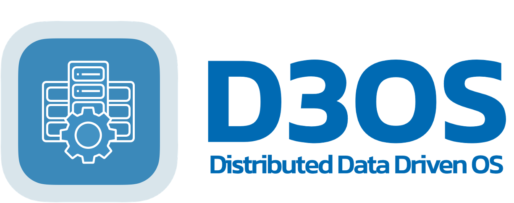

<p align="center">
  <a href="https://www.uni-duesseldorf.de/home/en/home.html"></a>
</p>

**A new distributed operating system for data centers, developed by the [operating systems group](https://www.cs.hhu.de/en/research-groups/operating-systems.html) of the department of computer science at [Heinrich Heine University Düsseldorf](https://www.hhu.de)**

<p align="center">
  <a href="https://www.uni-duesseldorf.de/home/en/home.html"></a>
</p>

<p align="center">
  <a href="https://github.com/hhu-bsinfo/D3OS/actions/workflows/build.yml"></a>
  
  
</p>

## Requirements

For building D3OS, a _rust nightly_ toolchain is needed. To install _rust_ use [rustup](https://rustup.rs/):
```bash
rustup toolchain install nightly
rustup override set nightly
```

The toolchain `nightly-2025-05-05` is confirmed to work. If you are having problems with new versions, try:
```bash
rustup toolchain install nightly-2025-05-05
rustup override set nightly-2025-05-05
```

To run the build commands _cargo-make_ is required. Install it with:
```bash
cargo install --no-default-features cargo-make
```

Furthermore, the following packages for Debian/Ubuntu based systems (or their equivalent packages on other distributions) need to be installed:
```bash
apt install build-essential nasm dosfstools wget qemu-system-x86_64
```

## Build and Run

To build D3OS and run it in QEMU, just execute:
```bash
cargo make --no-workspace
```

To build a release version of D3OS (much faster) and run it in QEMU, just execute:
```bash
cargo make --no-workspace --profile production
```


To only build the bootable image _d3os.img_, run:
```bash
cargo make --no-workspace image
```

## Debugging 

### In a terminal with gdb

Open a terminal and compile and start D3OS in `qemu` halted by `gdb` with the following commands:
```bash
cargo make --no-workspace clean
cargo make --no-workspace debug
```

Open another terminal and start `gdb` with:
```bash
cargo make --no-workspace gdb
```
This will fire booting D3OS and stop in `boot.rs::start`.

Setting a breakpoint in `gdb`:
```bash
break kernel::naming::api::init
```
For further commands check [GDB Quick Reference](docs/gdb-commands.pdf).

## Creating a bootable USB stick

### Using towboot
D3OS uses [towboot](https://github.com/hhuOS/towboot) which is already installed after you have successfully compiled D3OS. 

Use following command (in the D3OS directory) to create a bootable media for the device referenced by `/mnt/external`

`$ towbootctl install /mnt/external --removable -- -config towboot.toml`

### Using balenaEtcher
Write the file `d3os.img` using [balenaEtcher](https://etcher.balena.io) to your USB stick.


